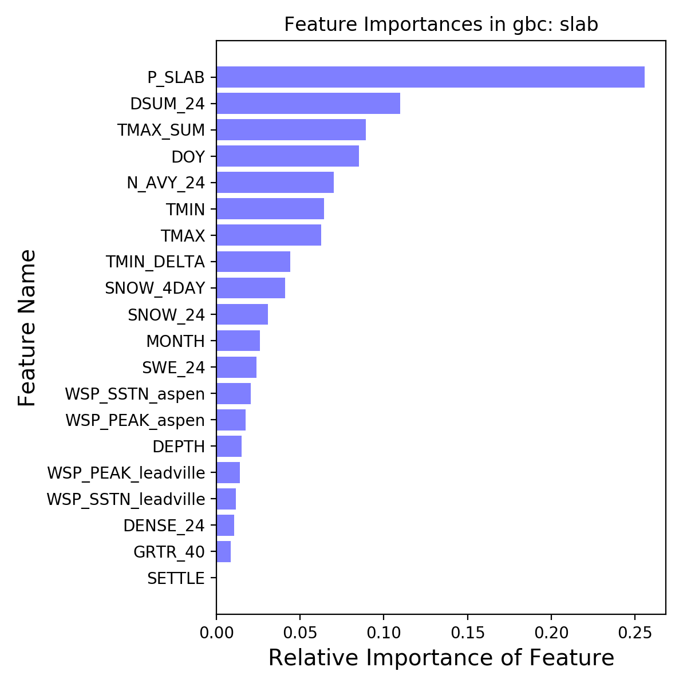
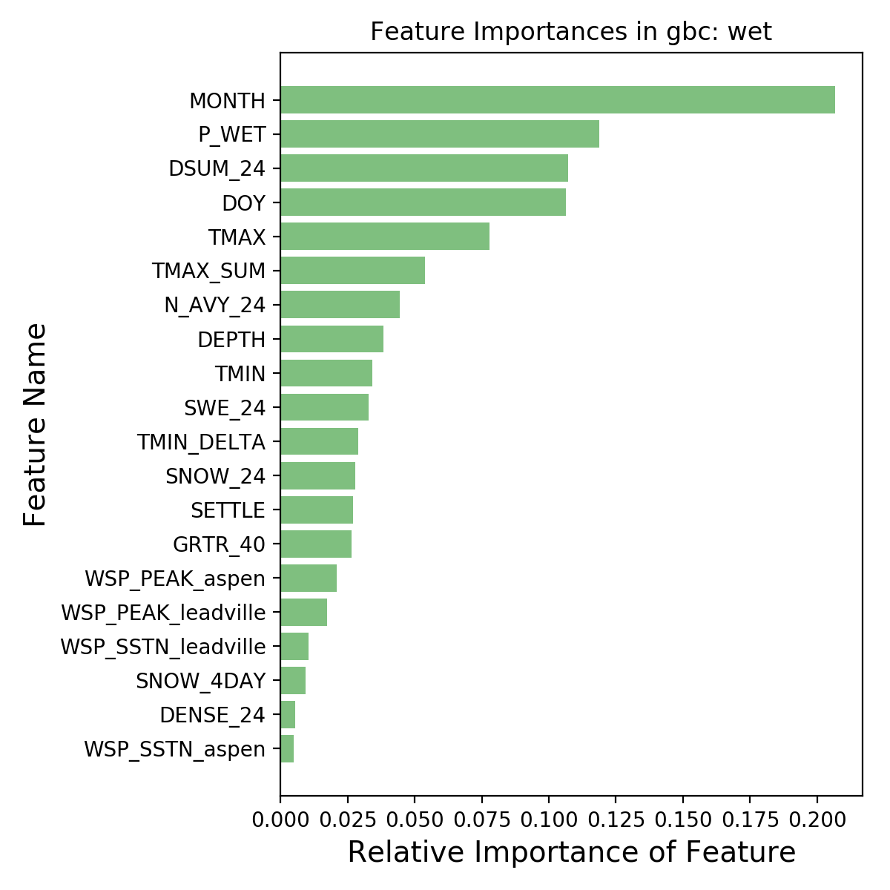

Readme
## Empirical avalanche prediction in Colorado:
#### Can a machine-learning model trained on historical climate, snow, and avalanche data augment prediction of avalanche risk?

__A capstone project for the Galvanize Data Science Immersive.__

_source: Staying Alive in Avalanche Terrain, Bruce Tremper, The Mountaineers Books_

__DISCLAIMER:__ This information is NOT intended to be used as an avalanche risk forecast. This is an empirical study done for scientific purposes. Please refer to the professionals for avalanche forecasts:

http://avalanche.state.co.us

### Data sources:
__Colorado Avalanche Information Center data__ (Colorado Department of Natural Resources)

| 10 Backcountry Zones | Avalanche observations |
|----|----|
| |  |

avalanche observation data back to 1980:

features: _date, zone, type, size_

__weather data__
SNOTEL sensor network (NRCS, USDA):

_source: NRCS National Water and Climate Center, USDA_

Local Climatalogical Data (commonly airports):

### Model development: training data
|Where            |  Which events | How frequent? |
|:-------------------------:|:-------------------------:|:----:|
|  |  |  |

__Backcountry Zone:__ Aspen, CO
__Destructive size:__ D2 or greater
__Training data:__ 2011-2016 winters (6 seasons)
__Validation data:__ 2017-2018 winter

#### modeling strategy:
__classification model:__
  - binary prediction: 1 if avalanche, 0 if none
  - probability prediction: p(avalanche), evaluated from the sigmoid function:

 - testing two models:
   - Random Forest Classifier
   - Gradient Boosting Classifier
   - (implemented in Scikit-Learn, python 3.5)

__best model: random forest classifier__
 - test accuracy = 0.942
 - test recall = 0.88

### feature engineering
 - use features that control the physical processes that create avalanche conditions:
   - snowfall, wind, temperature
 - literature: features used in avalanche modeling study in Little Cottonwood Canyon, UT
   - _Blatternberger and Fowles, 2016. Treed Avalanche Forecasting: Mitigating Avalanche Danger Utilizing Bayesian Additive Regression Trees. Journal of Forecasting, J. Forecast. 36, 165–180 (2017). DOI: 10.1002/for.2421_

### Feature augmentation: probability of slab/ wet avalanches:
  - slab and wet avalanches have overlapping, yet different seasons:

  - relative probability modeled as Gaussian KDE function:
  - p(slab), p(wet) as function of day-of-year
    - _for water year, starting on october 1_
  - $\Sigma (p_{slab}, p_{wet}) = p_{avalanche}$

### ensemble of 2 models:

__training:__
 - training data: Aspen Zone, period of record from 2010-2016, CAIC records for D rating > 2 avalanches
 - target: binary label for occurence of any avalanches with D rating > 2
 - separate targets for slab and wet occurence
 - separate models for slab and wet avalanches
   - each model does not include # or probability of other type of avalanche

__testing:__
- test data: 2016 - 2018 period of record
- predict probability of positive class with each model (slab/wet avalanche occured)

- evaluate model accuracy and recall  

### ensemble model feature importances:

| slab model | wet model |
|---|---|
|  | |

__similarities:__
 - same relative order of feature groups:
   1. date, storm cycle features
   2. temperature features
   3. snowpack features
   4. wind speed features

__notable differences that make physical sense:__
 - 'TMAX' important in both (7th, 5th, respectively), but partial dependence plots show:
   - positive relationship in wet model (i.e. p(wet) increases with warm day temps)
   - inverse relationship in slab model (i.e., p(slab) decreases with warm day temps)

 - Snowpack features:
   - 'SNOW_DAY' important in slab model
   - 'SETTLE' important in wet model

### modeling metrics
__best model results:__

|   | p(slab) | p(wet) | p(slab + wet) |
|-----|-----|-----|-----|
| accuracy | 0.938 | 0.938 | 0.920 |
| precision | 0.851 | 0.476 | 0.860 |
| recall | 0.932 | 0.625 | 0.880 |

__best model parameters:__ (determined by grid search on AWS EC2, optimized for recall)
 - gradient boosting classifier, slab:
   - {'criterion': 'friedman_mse', 'learning_rate': 0.01, 'loss': 'exponential', 'max_features': 'log2', 'min_samples_leaf': 4, 'min_samples_split': 6, 'n_estimators': 400, 'subsample': 0.8}

 - gradient boosting classifier, wet:
   - {'criterion': 'friedman_mse', 'learning_rate': 0.05, 'loss': 'deviance', 'max_features': 'log2', 'min_samples_leaf': 5, 'min_samples_split': 5, 'n_estimators': 600, 'subsample': 0.4}

__check against naive model:__

naive: ones
accuracy: 0.282
precision: 0.288
recall: 0.928

naive: zeros
accuracy: 0.717
precision: 1.0
recall: 0.0714
